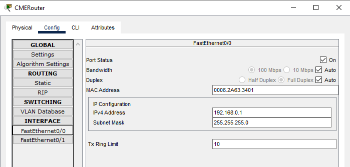

University: [ITMO University](https://itmo.ru/ru/)  
Faculty: [FICT](https://fict.itmo.ru)  
Course: [IP-telephony](https://itmo-ict-faculty.github.io/ip-telephony/)  
Year: 2024/2025  
Group: K34212  
Author: Kuznetsov Nikita
Lab: Lab1  
Date of create: 01.03.2025  
Date of finished: 02.03.2025  


## Отчет по лабораторной работе №1
### "Базовая настройка ip-телефонов в среде Сisco packet tracer"

## Цель  
Изучить рабочую среду Cisco Packet Tracer, ознакомиться с интерфейсами основных устройств, типами кабелей, научиться собирать топологию. Изучить построение сети IP-телефонии с помощью маршрутизатора, коммутатора и IP телефонов Cisco 7960 в среде Packet tracer

## Ход работы

### __Часть 1__

В части №1 необходимо было собрать сеть по схеме. В результате получилась следующая сеть:


Для каждого компьютера был выдан статический IP-адрес в подсети `192.168.0.0/24`:


Соединение было успешно установлено. Для примера был пропингован тот же `PC2` с компьютера `PC4`:


### __Часть 2__

В следующей части необходимо было собрать сеть с двумя телефонами, маршрутизатором и роутером. В результате получилась следующая сеть:


Для этого необходимо было настроить интерфейс fa0/0 на маршрутизаторе Cisco 2811 (CMERouter):



Далее, необходимо было настроить DHCP-сервер на маршрутизаторе: 

1. Был создан DHCP-пул `192.168.0.0/24`

```sh
ip dhcp pool voice
   network 192.168.0.0 255.255.255.0
   default-router 192.168.0.1
   option 150 ip 192.168.0.1 # включение настройки CallManager Express
```


2. Была произведена настройка CallManager Express через команды `telephony-service`:

```sh
telephony-service
   max-ephones 2        # максимальное количество IP-телефонов
   max-dn 2             # максимальное количество номеров
   ip source-address 192.168.0.1 port 2000 # IP-адрес голосового шлюза
   auto assign 1 to 1   # автоматическое назначение внешних номеров
```


3. На коммутаторе был переключен порт для каждого активного интерфейса: `switchport voice 1`

В результате IP-адреса на телефонах были успешно настроены:


Проверяем связность, задаем номера и набираем:

```sh
ephone-dn 1
   number 11111

ephone-dn 2
   number 22222
```


## Вывод

В результате работы была изучена рабочая среда Cisco Packet Tracer. Изучено построение сети IP-телефонии с помощью маршрутизатора, коммутатора и IP телефонов Cisco 7960 в среде Packet tracer. Настроена базовая сеть из двух телефонов, маршрутизатора и роутера.