University: [ITMO University](https://itmo.ru/ru/)  
Faculty: [FICT](https://fict.itmo.ru)  
Course: [IP-telephony](https://itmo-ict-faculty.github.io/ip-telephony/)  
Year: 2024/2025  
Group: K34212  
Author: Kuznetsov Nikita
Lab: Lab2 
Date of create: 02.03.2025  
Date of finished: 03.03.2025  

## Отчет по лабораторной работе №2
### "Конфигурация voip в среде Сisco packet tracer"

## Цель  
Изучить построение сети IP-телефонии с помощью маршрутизатора Cisco 2811, коммутатора Cisco catalyst 3560 и IP телефонов Cisco 7960.

## Ход работы

### __Часть 1__

Была создана сеть из роутера (CMERouter), L3 коммутатора и трех IP-телефоно по схеме:

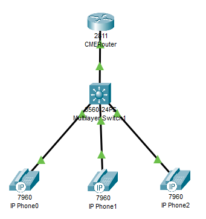

Далее, был отключен синтаксис ввода слов от DNS серверов, а также переименован роутер в CMERouter:

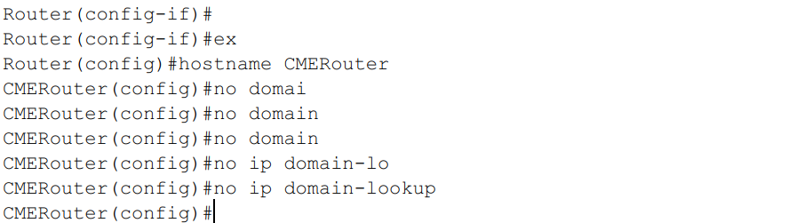

Также, был включен вход по паролю:

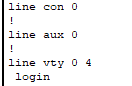

Далее, были настроены аналогично первой лабораторной работе DHCP-пул, маршрутизатор и выдаем номера трем телефонам:

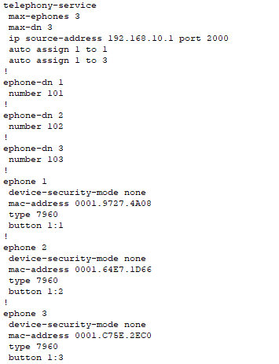

Связь работает:

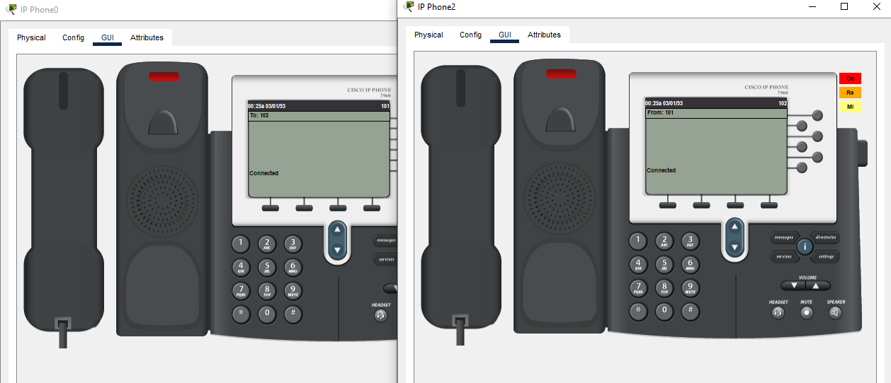

### __Часть 2__

Далее, схема была преобразована, были добавлены три компьютера:

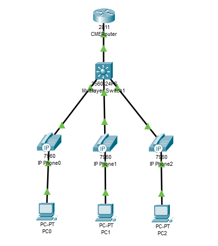

Далее, был выставлен `default gateway` для роутера:

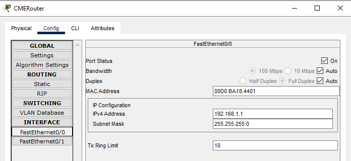

Далее были настроены VLAN:

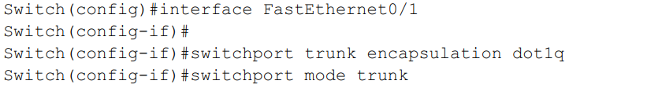

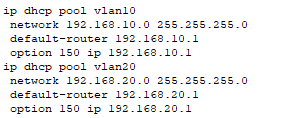

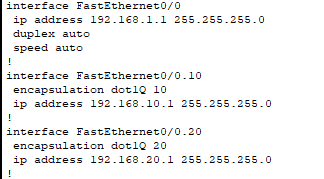

- `vlan10` - для телефонов

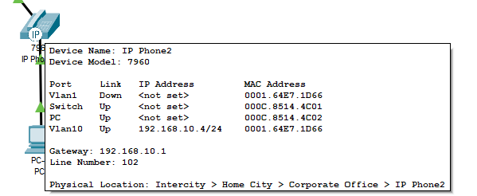

- `vlan20` - для ПК

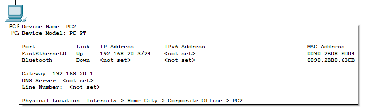

- Пинги по vlan20 (`PC0` -> `PC1`, `PC0` -> `PC2`):

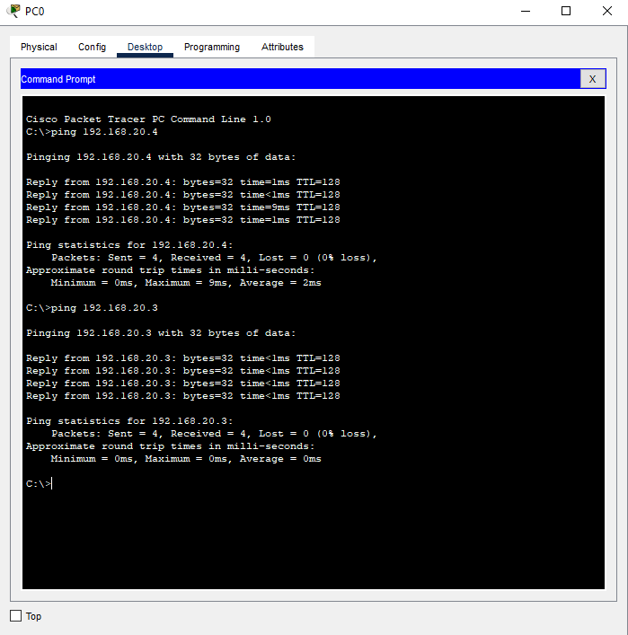

- Проверка связи телефонов:

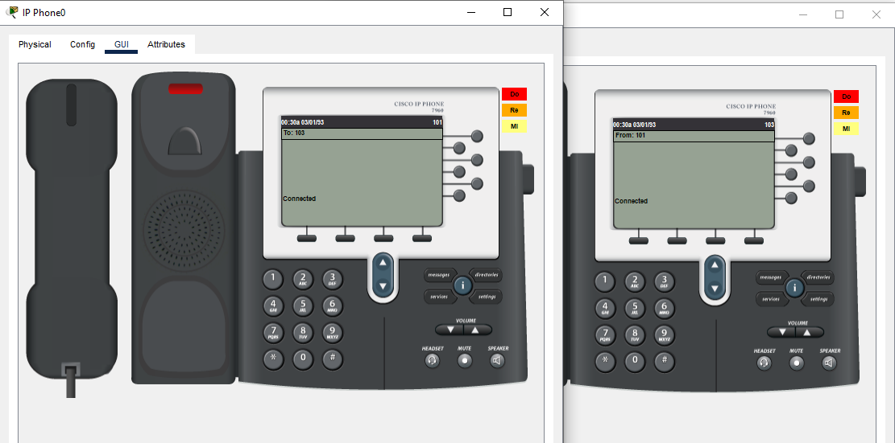

## Вывод

В результате работы было изучено построение сети IP-телефонии с помощью маршрутизатора Cisco 2811, коммутатора Cisco catalyst 3560 и IP телефонов Cisco 7960.