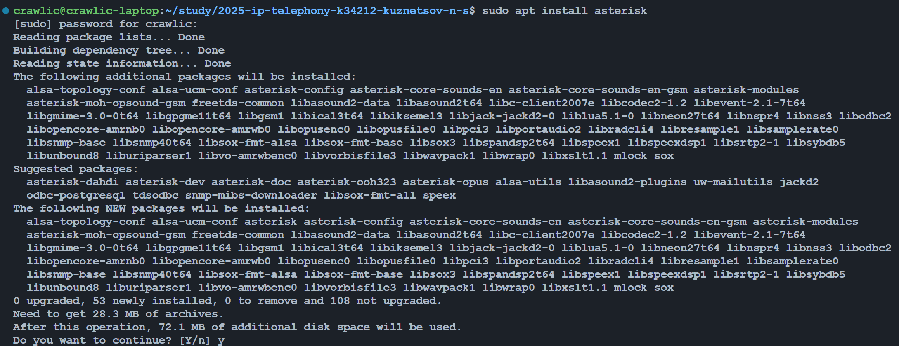
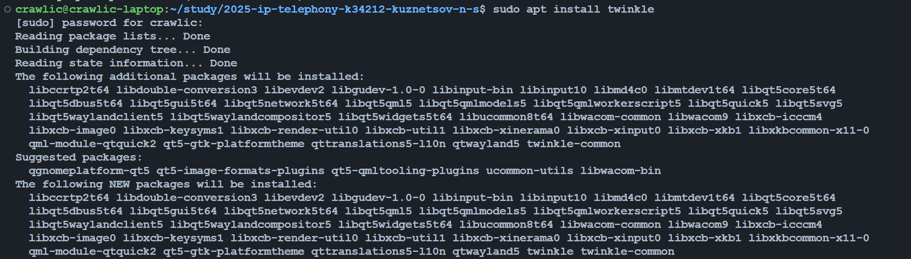
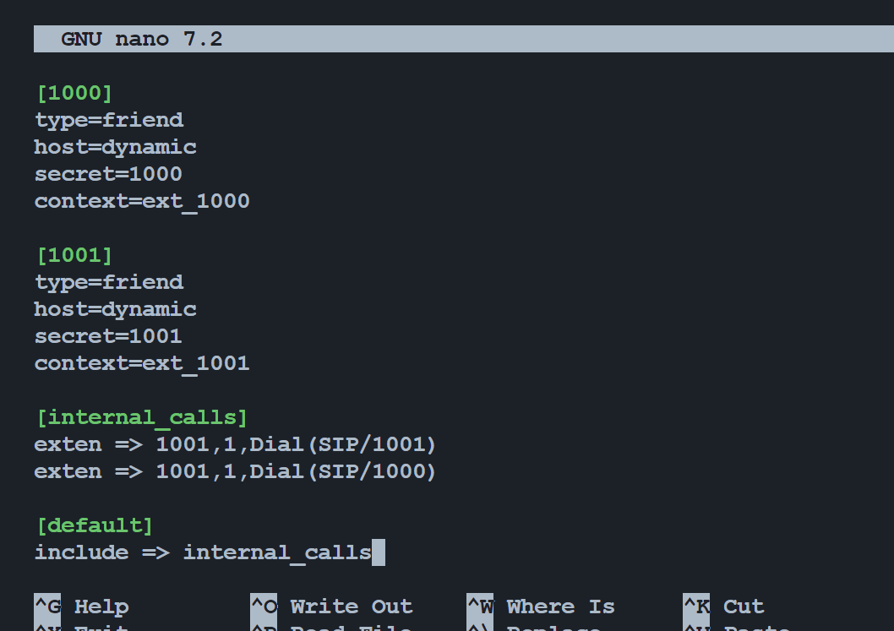
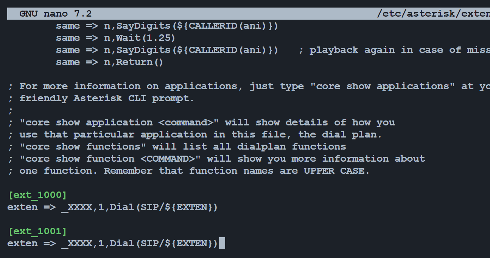
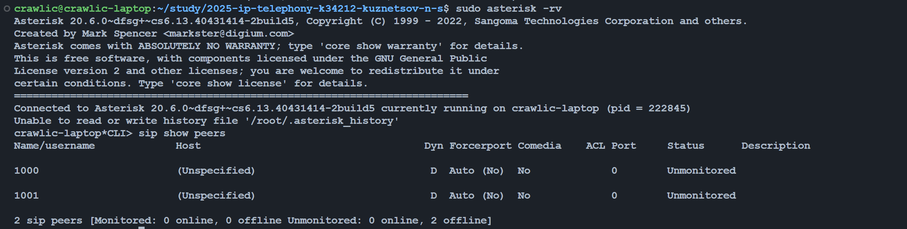
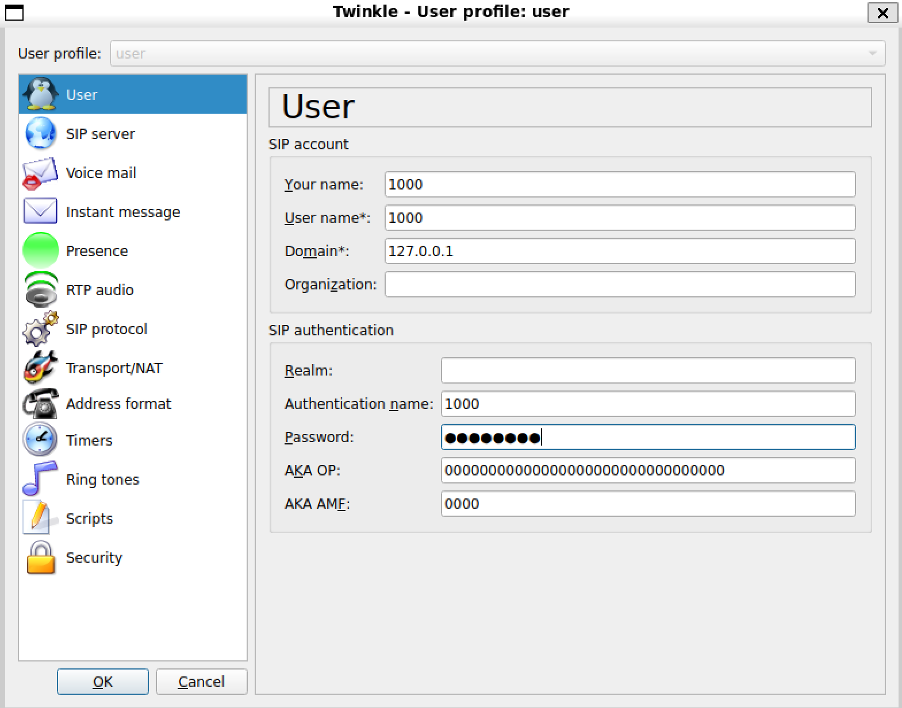
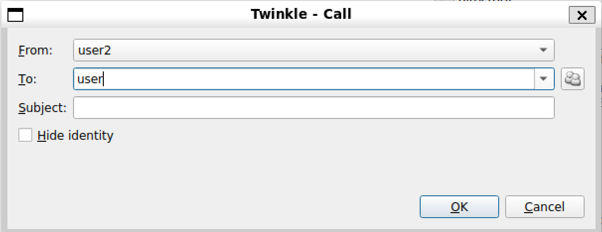
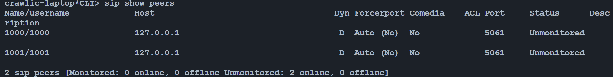
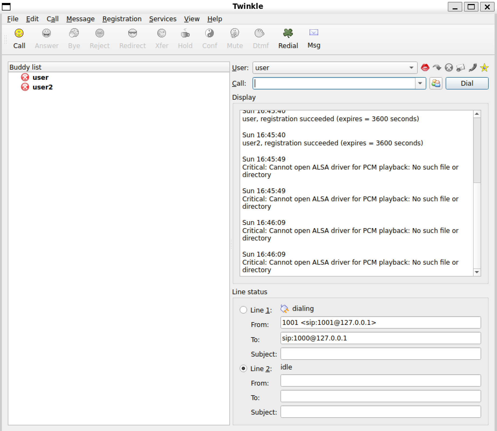
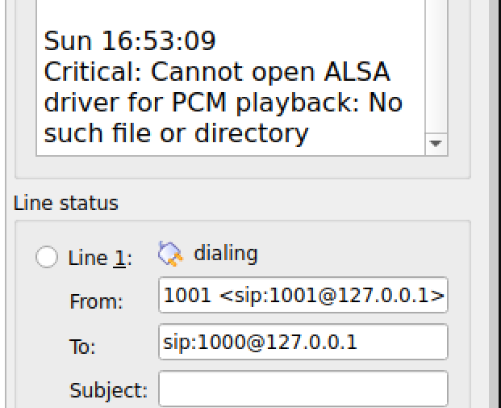

University: [ITMO University](https://itmo.ru/ru/)  
Faculty: [FICT](https://fict.itmo.ru)  
Course: [IP-telephony](https://itmo-ict-faculty.github.io/ip-telephony/)  
Year: 2024/2025  
Group: K34212  
Author: Kuznetsov Nikita
Lab: Lab3
Date of create: 03.03.2025  
Date of finished: 04.03.2025

## Отчет по лабораторной работе №3

### "Использование Asterisk в качестве SIP proxy"

## Цель

Изучить программный комплекс Asterisk. Настройка Asterisk для локальных звонков.

## Ход работы

