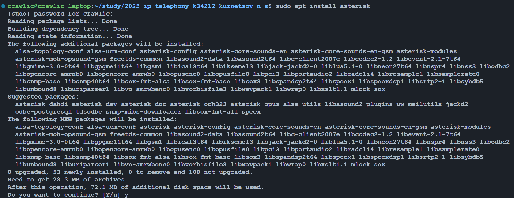
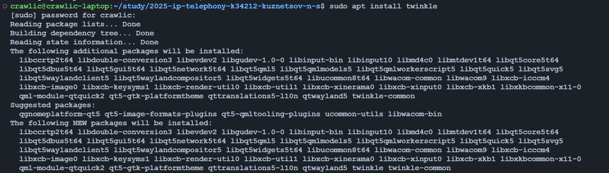
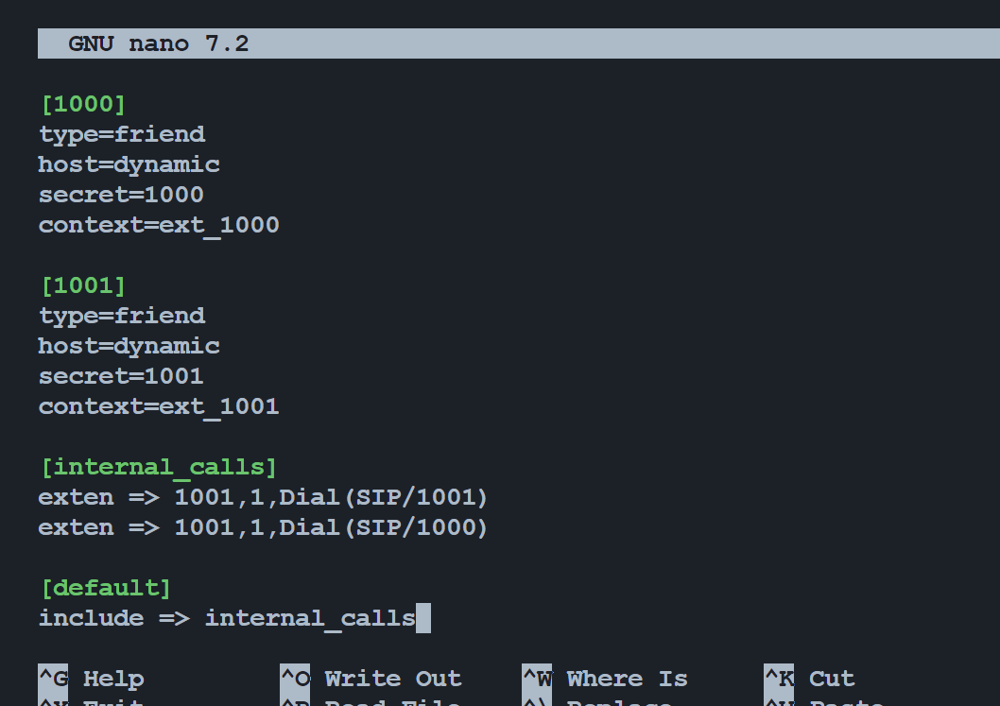
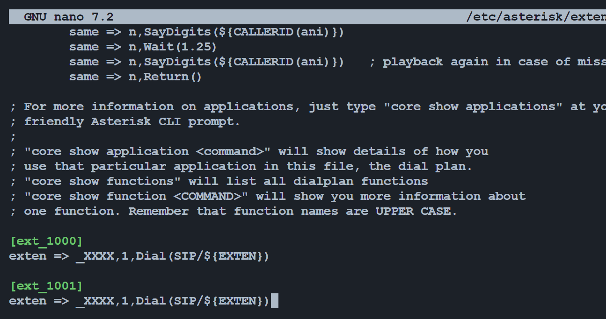
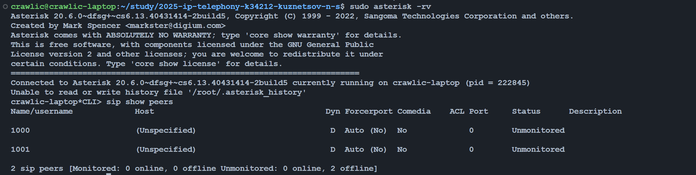
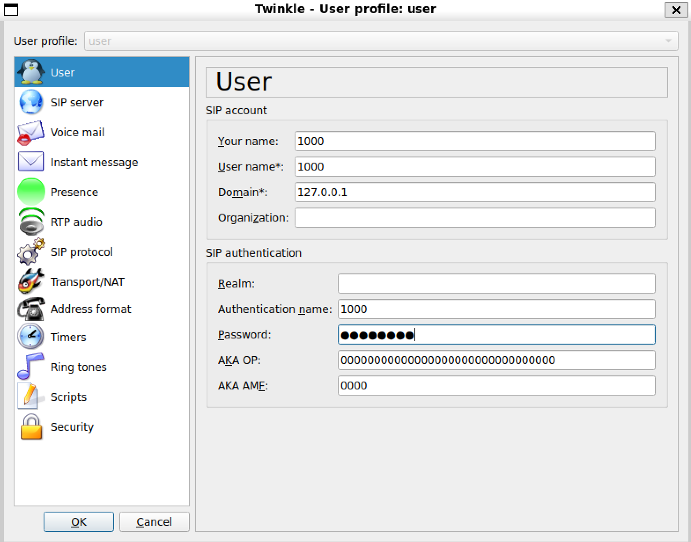
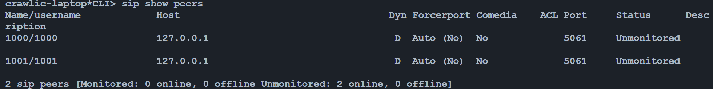
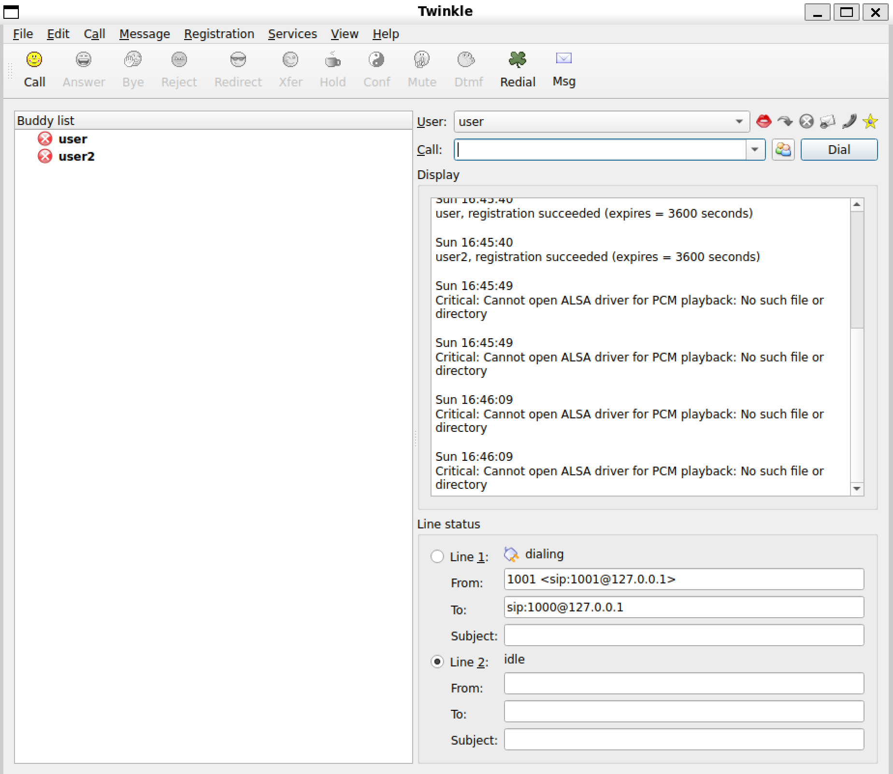
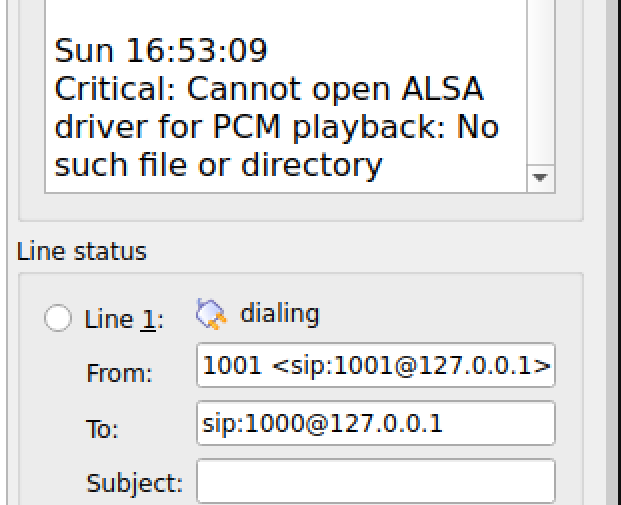

University: [ITMO University](https://itmo.ru/ru/)  
Faculty: [FICT](https://fict.itmo.ru)  
Course: [IP-telephony](https://itmo-ict-faculty.github.io/ip-telephony/)  
Year: 2024/2025  
Group: K34212  
Author: Kuznetsov Nikita
Lab: Lab3
Date of create: 03.03.2025  
Date of finished: 04.03.2025

## Отчет по лабораторной работе №3

### "Использование Asterisk в качестве SIP proxy"

## Цель

Изучить программный комплекс Asterisk. Настройка Asterisk для локальных звонков.

## Ход работы

Для начала необходимо было установить `Asterisk`. Это программа для установления связи между клиентами по протоколу SIP.



Для работы IP телефонии необходимо установить soft phone ПО - для этой цели был выбран `twinkle`. Оно превращает компьютер, смартфон или планшет в виртуальный телефон и позволяет совершать звонки через интернет (VoIP).



Далее, необходимо настроить `SIP` канал через конфиги `Asterisk`. Данный протокол используется для установления, управления и завершения мультимедийных сессий (голосовых и видеозвонков, обмена сообщениями) через Интернет.

Для начала необходимо было отредактировать файл `/etc/asterisk/sip.conf`:



Тут настраиваются следующие параметры:
 - `1000`: идентификатор пользователя
 - `type=friend`: аккаунт может и принимать, и совершать звонки
 - `host=dynamic`: доступ к сервису как с софтфона так и с других устройств
 - `secret=1000`: пароль для аутентификации на сервере
 - `context=ext_1000`: контекст для маршрутизации звонка
 - `internal_calls`: контекст для внутренних звонков
 - `exten => 100?,1,Dial(SIP/100?)`: указывает маршрутизацию, что при обращении по номеру возвращается нужный пользователь

Также был настроен файл `/etc/asterisk/extentions.conf`:



Тут настраиваются параметры:
 - `ext_100?`: контекст для пользователя `100?`
 - `_XXXX`: шаблон номера, X - любая цифра, принимает только четырехзначный номер
 - `1`: приоритет команды, в данном случае первый
 - `Dial(SIP/${EXTEN})`: команда установления звонка, подставляет набранный номер

После всех настроек перезапускается сервис `asterisk`. Выводится список устройств, видно что два устройства есть, но они оффлайн.

```sh
systemctl restart asterisk
asterisk -rv 
CLI> sip show peers
```



Далее, необходимо создать двух пользователей согласно предыдущей конфигурации в программе `twinkle`:



После регистрации и запуска программы в `asterisk` отображаются два онлайн устройства:



После всех настроек можно попробовать набрать по номеру другого пользователя. Из-за того, что есть некоторые ошибки со звуковыми драйверами (видимо из-за того, что Linux запущен в WSL) звонок не приходит другому пользователю.

Однако других ошибок нет - аутентификация проходит и звонок идет, а значит все ок и звонки можно совершать, если поправить ошибку с драйверами.





## Вывод

В результате лабораторной работы удалось изучить программный комплекс Asterisk и настроить его для локальных звонков.

